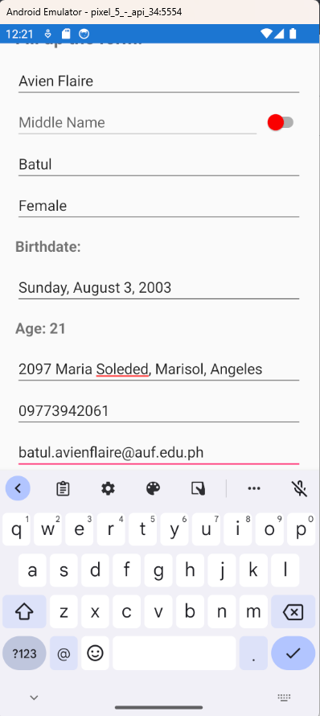

# Module 05 - Exercise 01

## PersonalInfoPage
[PersonalInfoPage.xaml](Module05Forms/Module05Forms/PersonalInfoPage.xaml)
[PersonalInfoPage.xaml.cs](Module05Forms/Module05Forms/PersonalInfoPage.xaml.cs)

## Enabled Middle Name

## Email

## Contact Number

## Disabled middle name, birthdate with age and masked password

